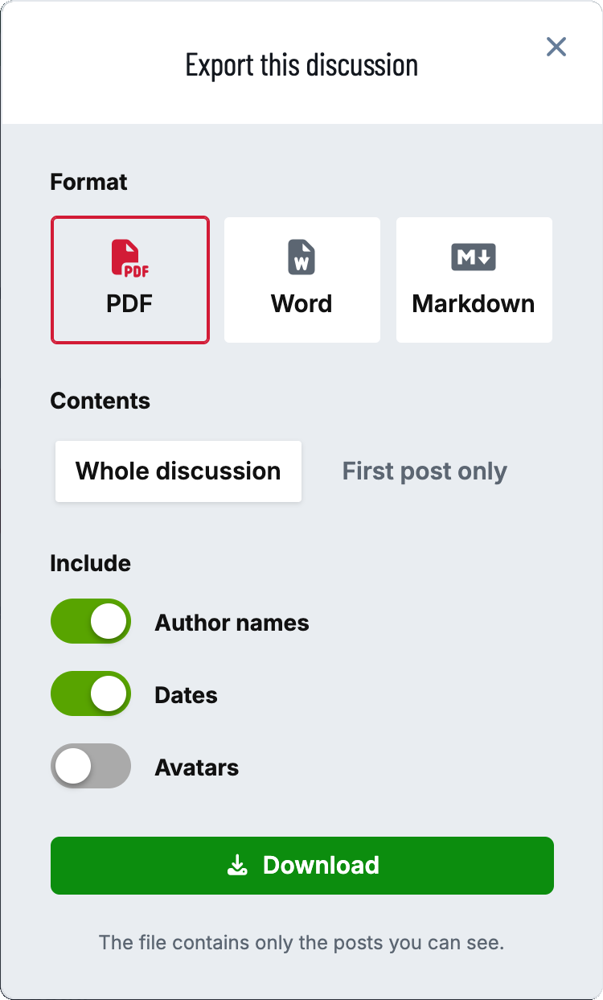
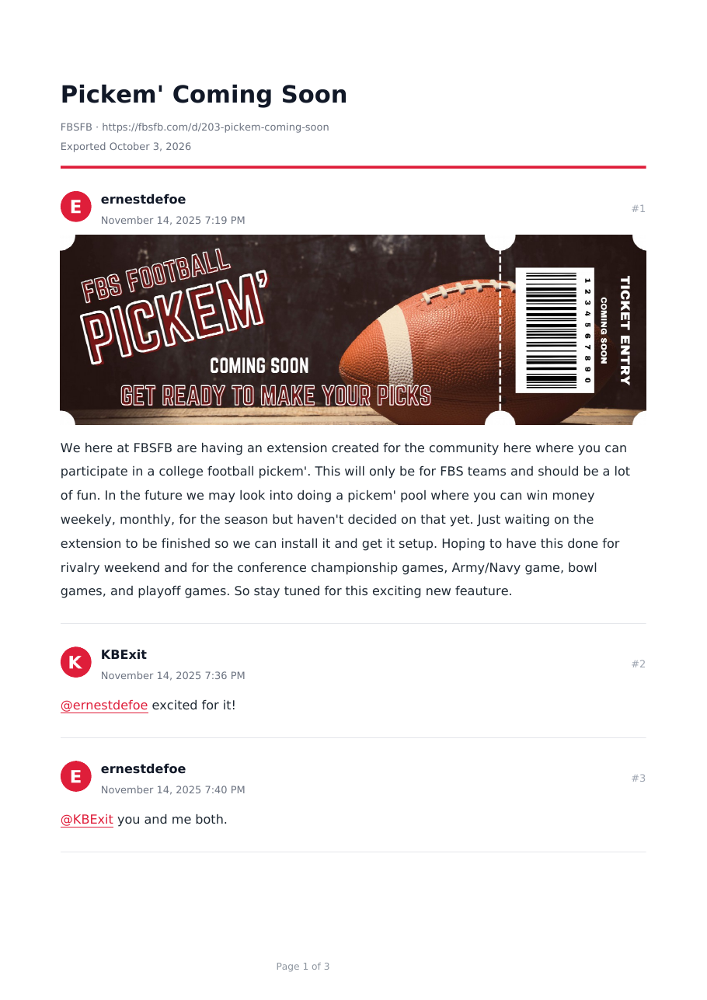

# Folio

Export a discussion as a **PDF**, a **Word document** or **Markdown**: for archiving it, sharing it offline, printing it, or turning a support thread into documentation.



**Export** sits in the discussion's menu, next to Reply. The reader picks:

- **Format:** PDF, Word or Markdown.
- **Contents:** the whole discussion, or just the first post.
- **Include:** author names, dates, and avatars (PDF and Word).

The dialog remembers each reader's last choices.



## What goes in the file

- **Only what the reader can see.** An export holds exactly the posts the person exporting could scroll to. Private discussions, hidden posts and anything their groups can't see stay out, the same as on the page.
- **The forum's look.** The title, the forum's name and a link back, then each post with its author, date and number, ruled off in the forum's primary colour. PDFs are numbered "Page 3 of 12".
- **Images inside the file**, so a PDF saved today still shows its pictures in five years:
  - files uploaded to the forum, including uploads [FoF Upload](https://github.com/FriendsOfFlarum/upload) keeps on S3, R2 or a CDN;
  - avatars;
  - emoji, so 👍 stays 👍 rather than an empty box.

  Images hotlinked from other websites become links unless you switch them on (see **Settings**). Markdown always links to its images, because Markdown can't carry the file itself.
- **Nothing that can't go on paper** is lost silently: a video or an embed becomes a link to it, and a spoiler is labelled as one.
- **Long content fits the page.** Long URLs wrap, tall images shrink to one page, wide images and tables fit the width, and code blocks wrap their long lines.

## Settings

- **Formats:** PDF, Word and Markdown, each on or off.
- **Paper size:** A4 or US Letter.
- **Header and footer text:** placeholders `{forum}`, `{title}`, `{date}` and `{url}` are filled in.
- **File name:** `{title}` by default; `{id}`, `{date}` and `{forum}` also work.
- **Most posts in one export:** 500 by default. A longer discussion is cut there, and the file says how many posts were left out.
- **Include images from other websites:** off by default.
- **Custom CSS for PDF exports:** applies to exported PDFs only, never to the forum.

**Permission:** *Export discussions*, granted to members on install. With [Flarum Tags](https://github.com/flarum/tags) it can be set per tag.

## Good to know

- **Exports are rate-limited:** one every few seconds per person, one running at a time per person and two at a time across the forum, admins excepted. A long PDF is real work for the server, and nobody can tie up every PHP worker with it.
- **Images from other websites are fetched carefully** when you allow them. Folio refuses private and internal network addresses, follows no redirects, waits at most a few seconds, and caps each image at 5 MB. A post can't use an export to make your server request something on your own network.
- **Big screenshots are scaled to the page** and saved as JPEG, which keeps a thread full of screenshots to a few megabytes and a few seconds.
- **Every language in Word and Markdown.** Both use the reader's own fonts, so any script works.
- **PDFs in Chinese, Japanese, Korean, Arabic, Hebrew, Hindi, Thai and other complex scripts** need one extra package:

  ```sh
  composer require mpdf/mpdf
  ```

  With it installed, Folio sets those discussions with mPDF automatically: it uses the right font for each script, joins Arabic letters, and lays out right-to-left text. Everything else keeps the faster default engine. Without it, a PDF of such a discussion is refused with a one-click switch to Word, rather than printing empty boxes. The settings page tells you which state you're in. mPDF is about 90 MB, mostly fonts, which is why it is optional.

## For extension developers

Content that isn't plain HTML (a poll, an event card) can supply a static version of itself for exports:

```php
use Ernestdefoe\Folio\Event\PreparingPost;

(new Extend\Event())->listen(PreparingPost::class, function (PreparingPost $event) {
    $event->html .= '<p>Poll results: …</p>'; // or $event->skip = true;
}),
```

A new export format (EPUB, say) implements `Ernestdefoe\Folio\Format\Format` and is registered with:

```php
(new \Ernestdefoe\Folio\Extend\Folio())->format(EpubFormat::class),
```

It appears in the dialog with its own on/off switch.

## Installation

```sh
composer require ernestdefoe/folio
```

Then enable **Folio** in the admin panel.

## Updating

```sh
composer update ernestdefoe/folio
php flarum cache:clear
```

## Licence

MIT. Folio uses [Dompdf](https://github.com/dompdf/dompdf) (LGPL-2.1), [PHPWord](https://github.com/PHPOffice/PHPWord) (LGPL-3.0) and [HTML To Markdown](https://github.com/thephpleague/html-to-markdown) (MIT), installed as their own packages.
